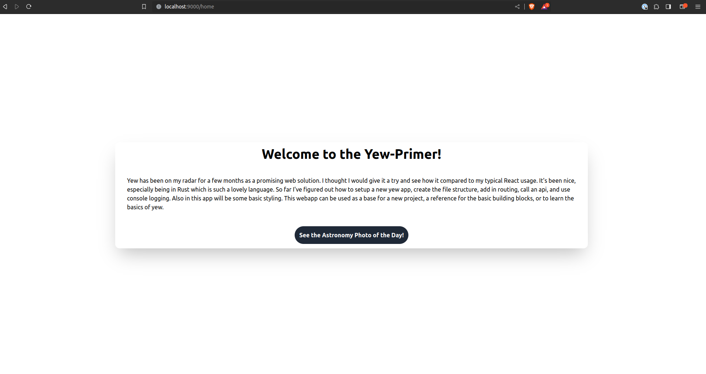
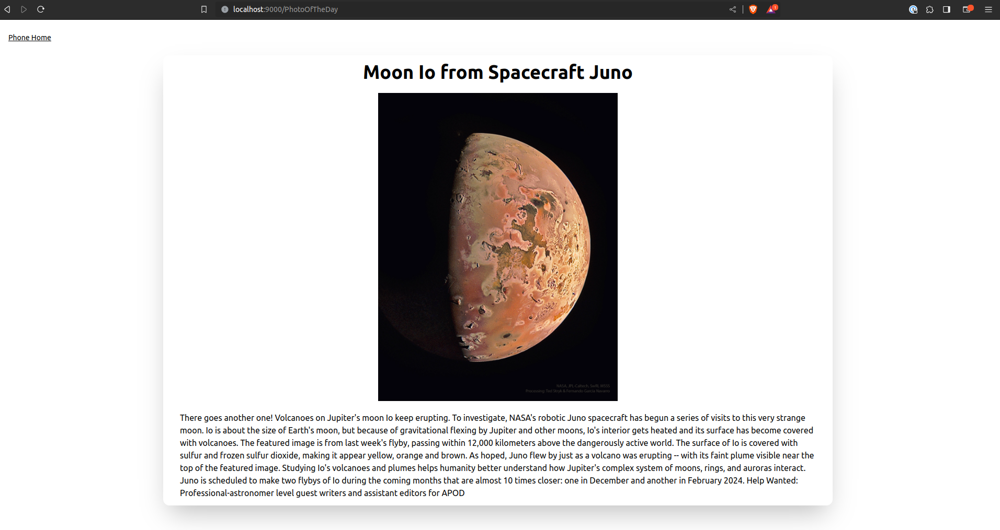

# Yew-Primer
Example webapp made with Yew

## Prerequisites
- The Rust Book: https://doc.rust-lang.org/stable/book/
- Have Rust installed
  - You can see if Rust is installed with ```cargo -v``` or ```rustup -v```
  - If it is not: https://www.rust-lang.org/tools/install
- Following the Yew tutorial: https://yew.rs/docs/tutorial
  - Install trunk with cargo ```cargo install trunk```
  - Add WASM build target ```rustup target add wasm32-unknown-unknown```

## Creating the Rust Project
```
cargo new yew-primer
cd yew-primer
cargo run
```
- Should return "Hello, world!"

## What does a WebApp Primer Look Like?
A webapp primer has 3 main goals:
- Learn the desired platform
- Use an API to display data
- Create a multipage application 

## Goals of the Yew Primer
- Learn how to use Rust in a web application setting
- Use the NASA Astronomy Photo of the Day (APOD) API
- Create a simple two page application showing the photo of the day

## Yew Web App Structure
One of the first things to do is set up a proper structure so the project can stay organized
```
|-- Cargo.toml
|-- index.html
|-- Trunk.toml
|-- tairlwind.config.js
|-- tailwind.css
|-- src
    |-- main.rs
    |-- lib.rs
    |-- app
        |-- mod.rs
        |-- app.rs 
        |-- routes.rs
    |-- components
        |-- mod.rs
        |-- home.rs
        |-- ...
    |-- pages
        |-- mod.rs
        |-- ...
    |-- utils
        |-- mod.rs
        |-- ...
|-- public
    |-- ...
|-- tests
    |-- ...
|-- LICENSE
|-- README.md
|-- .gitignore
```

## Routing to Pages
Using the crate *yew_router*, an enum of *Routes* can be created to create a router to switch between routes.
```
use yew_router::prelude::*;

...

// Define the Route
#[derive(Debug, Clone, Copy, PartialEq, Routable)]
enum Route {
    #[at("/")]
    Home,
    #[at("/page1")]
    Page1,
    #[not_found]
    #[at("/404")]
    NotFound,
}

fn switch(route: Route) -> Html {
    match route {
        Route::Home => html! { <h1>{ "Home" }</h1> },
        Route::Page1 => html! {
            <Page1 />
        },
        Route::NotFound => html! { <h1>{ "404" }</h1> },
    }
}

#[function_component(App)]
pub fn app() -> Html {
    html! {
        <BrowserRouter>
            <Switch<Route> render={switch} />
        </BrowserRouter>
    }
}
```

## Yew Hooks

Using a stateful value is great for something that will change and creates a need for the page to rerender to see updates. This can be done with use_state:
```
let stateful_object: UseStateHandle<Type> = use_state(|| initial_value);
```
- The stateful_object can then be referenced in callbacks or in the web display.

use_effect is another useful hook, especially for API calls. It works by acting as soon as the page is loaded. For example, the stateful object above can be set to the return of an http request that is run in the use_effect code block.

## Console Logging
Logging in Yew is similar to logging in javascript. First add some dependencies to the *Cargo.toml*:
```
log = "0.4.6"
wasm-logger = "0.2.0"
```

The logger needs initialized in main as well: ```wasm_logger::init(wasm_logger::Config::default());```.

A message can then be logged like ```log::info!(msg);```

## Dependencies

For basic use
```
yew = { git = "https://github.com/yewstack/yew/", features = ["csr"] }
yew-router = { git = "https://github.com/yewstack/yew.git" }
```

For API calling and dealing with JSON
```
gloo-net = "0.2"
serde = { version = "1.0", features = ["derive"] }
wasm-bindgen-futures = "0.4"
serde_json = "1.0.107"
```

For Console Logging
```
log = "0.4.6"
wasm-logger = "0.2.0"
```

## Deployment

In a non-production environment, it is sufficient to run ```trunk serve --open```. Otherwise, build with ```trunk build --release```. Nginx was installed and the dist folder contents were copied to /var/www/yew-primer/. Then in *nginx/sites-available*, a file (*yew-primer*) was created with a symlink to *nginx/sites-enabled*. The file yew-primer contained:
```
server {
        listen localhost:9000;

        root /var/www/yew-primer;

        location / {
                try_files $uri /index.html;
        }
}
```

Then nginx was restarted with ```sudo systemctl restart nginx.service```. 

Lastly going to localhost:9000 brought up the static build.

## The Final Product





## Conclusion

Yew seems adequate and functional enough to be used in simple scenarios. Further creation will determine its fuller use capabilities. Since it uses Rust and WASM, there is extreme potential for this to become widely used in industry due to its efficiency, safety, and ease of use. 